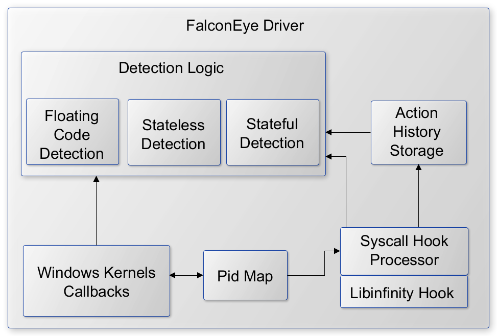

# FalconEye: Real-time detection software for Windows process injections

FalconEye is a windows endpoint detection software for real-time process
injections.

You can check our presentation at [2021 Blackhat ASIA Arsenal](https://www.blackhat.com/asia-21/arsenal/schedule/#falconeye-windows-process-injection-techniques---catch-them-all-22612) and [slides](https://github.com/rajiv2790/FalconEye/blob/main/2021BHASIA_FalconEye.pdf).

## Project Overview

### Detection Coverage

The table below shows the implementation status and the detection logic for the
process injection techniques. WPM stands for WriteProcessMemory. To test the
detection, one can refer to the references section. 

| Technique                                     | Status  | Detection  |
| -------------                                 | ------- | -----------|
| Atombombing                                   | &check; | Hook QueueUserAPC and look for GlobalGetAtom  |
| Instrumentation callback injection            | &check; | Detect if a new thread is created with floating code |
| PROPGate                                      | &check; | Detect if a new thread is created with floating code and if PE header is being written into victim|
| CreateRemoteThread with LoadLibrary           | &check; | Hook SetProp function and match the previous WPM calls to get the address of floating code |
| CreateRemoteThread with MapViewOfFile         | &check; | Detected using PE header written into target process memory |
| Suspend-Injection-Resume                      | &check; | New thread with start address pointing to LoadLibrary |
| QueueUserAPC                                  | &check; | DLL path being written via WPM |
| SetWindowLong (Extra window memory injection) | &check; | QueueUserApc for memset into victim process |
| Unmap + Overwrite                             | &check; | Unmapping ntdll |
| Kernel Ctrl Table                             | &check; | Detect if NtWriteVirtualMemory is overwriting KernelCallbackTable field in the PEB of the victim |
| USERDATA                                      |         |    |
| Ctrl-inject                                   | &check; | Detect if the attacker does WPM in victim's KernelBase.dll range   |
| ALPC Callback                                 |         |    |
| WNF Callback                                  | &check; | WPM followed by UpdateWNFStateData call   |
| SetWindowsHook                                | &check;       |    |
| Service Control                               | &check; | WPM overwriting Service IDE. Can be made more precise   |
| Shellcode injection                           | &check; | New thread started from floating code. DLL path being written by WPM    |
| Image Mapping                                 | &check; | Thread started from floating code. PE header being written DLL path being written by WPM   |
| Thread Reuse                                  | &check; |  Thread started from floating code. DLL path being written by WPM  |
| GhostWriting                                  |         |    |
| Process Hollowing                             | &check; |  Detect using PE header written into target process memory  |


### Architecture Overview



1. The driver is an on-demand load driver
2. The initialization includes setting up callbacks and syscall hooks via
   libinfinityhook
3. The callbacks maintain a map of Pids built from cross process activity such
   as OpenProcess but it is not limited to OpenProcess
4. Subsequent callbacks and syscall hooks use this Pid map to reduce the noise
   in processing. As part of noise reduction, syscall hooks filter out the same
process activity.
5. The detection logic is divided in subcategories namely - stateless (example:
   Atombombing), stateful (Unmap+Overwrite) and Floating code(Shellcode from
multiple techniques)
6. For stateful detections, syscall hooks record an ActionHistory which is
   implemented as a circular buffer. e.g. It records all the
NtWriteVirtualMemory calls where the caller process is different from the
target process.
7. The detection logic has common anomaly detection functionality such as
   floating code detection or detection for shellcode triggers in remote
processes. Both callbacks and syscall hooks invoke this common functionality
for actual detection.

**Please note that, our focus has been detection and not creating a performant
detection engine. We’ll continue on making those efforts past this
presentation.


## Files
```bash
.
├── src 
│   ├── FalconEye ---------------------------# FalconEye user and kernel space
implementations
│   └── libinfinityhook ---------------------# Kernel hook implementation
├── 2021BHASIA_FalconEye.pdf
└── README.md
```

## Getting Started


### Prerequisite

### Installation

### Usages


## References
[]()
[]()

## License Terms
FalconEye is licensed to you under [Apache 2.0](COPYING) open source license. 
